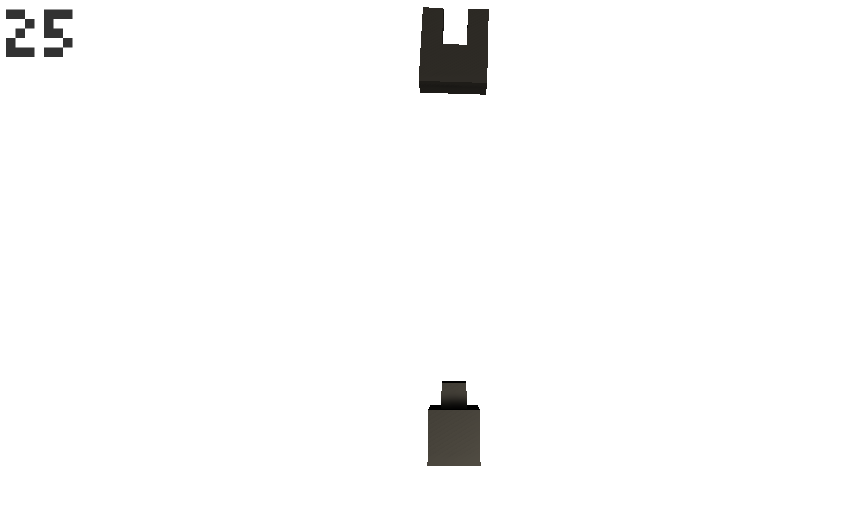

# Portfolio

- 江川顕
- 連絡先 Email [egawa.dat21@gmail.com](egawa.dat21@gmail.com)
- 専門学校デジタルアーツ東京 ゲームプログラムコース 2023年卒業予定

## スキル
- Unity
  - 利用歴1年
  - かんたんなゲームの作成が可能
- C/C++
  - 利用歴1年
  - Visual Studioで簡単なデータ処理プログラムの作成が可能

## 取り組んでいるテーマ
- Unityでの当たり判定やプログラムに必要な数学を学ぶ
-

## 作品リスト

### くぼみを狙え

くぼみを狙ってキューブを発射して嵌めるゲーム
- 開発環境：unity
- 開発期間：3日

### ブロック崩し

珠を当ててブロックを消していくゲーム

- 開発環境：unity
- 開発期間：4日

## 連絡先
- E-mail [egawa.dat21@gmail.com](egawa.dat21@gmail.com)
